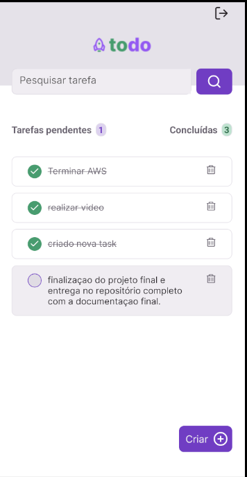

#  Aplicativo Gerenciador de Tarefas (ToDo)

## Introdução

Este projeto consiste em um aplicativo gerenciador de tarefas (to-do) desenvolvido com React Native, Typescript, e integrado a uma API na nuvem (AWS). O objetivo é criar uma ferramenta que permita aos usuários criar, visualizar, editar e excluir tarefas, além de proporcionar experiência prática em desenvolvimento mobile com integração de APIs.

## Funcionalidades

*   **Autenticação:** O aplicativo possui uma tela de login com credenciais fixas para acesso.
*   **Gerenciamento de Tarefas:** Permite criar, visualizar, editar e excluir tarefas.
*   **Listagem e Filtragem:** As tarefas podem ser visualizadas, filtradas por estado (criadas/concluídas) e pesquisadas por título ou descrição.
*   **Experiência do Usuário:** Exibe animações de carregamento durante interações com a API e mensagens de erro claras em caso de falhas.
*   **Testes Unitários:** Implementa testes unitários para garantir a qualidade e robustez do código.

## Instalação

1.  **Clonar o repositório:**
    ```bash
    git clone https://github.com/RaoniDCunha/TodoAppCompassChallenge.git
    ```
2.  **Navegar para o diretório do projeto:**
    ```bash
    cd TodoAppCompassChallenge
    ```
3.  **Instalar as dependências:**
    ```bash
    npm install
    ```
4.  **Rodar o projeto:**
    ```bash
     npm run android
    ```
5.  **Executar os testes:**
   ```bash
    npm test
   ```

## Bibliotecas Utilizadas

*   **React Native:** Framework para desenvolvimento de aplicativos mobile.
*   **Typescript:** Superset do Javascript que adiciona tipagem estática.
*   **styled-components:** Biblioteca para estilização com CSS-in-JS.
*   **axios:** Cliente HTTP para fazer requisições à API.
*   **Expo:** Framework para React Native que facilita o desenvolvimento, teste e deploy.
*   **Jest:** Framework de testes para Javascript.
*   **React Testing Library:** Biblioteca para testar componentes React de maneira orientada ao usuário.

## Estrutura da API

A API é fornecida para o uso no projeto e possui os seguintes endpoints:

*   `POST /login`: Autenticar usuário.
    *   Body: `{username: <username>, password: <password>}`
*   `GET /tarefas`: Obter todas as tarefas.
*   `POST /tarefas`: Criar nova tarefa.
    *   Body: `{tarefa: <texto da tarefa>}`
*   `PUT /tarefas/{id}`: Atualizar tarefa pelo ID.
    *   Body: `{tarefa: <texto da tarefa>}`
*   `DELETE /tarefas/{id}`: Deletar tarefa pelo ID.

**Detalhe:** O usuário fixo para login é: `username: admin`, `password: password`.

## Design do Projeto



## Vídeos

A seguir, vídeos que demonstram as funcionalidades, configurações e execução do projeto:

### Demonstração da Aplicação

[Link do Vídeo de Demonstração da Aplicação](https://youtube.com/shorts/zopJvN1W8gs)

### Explicação do Projeto

[Link do Vídeo de Explicação do Projeto](https://youtu.be/3KuYCdZYhUw)

### Executando o Projeto e Testes no Terminal

[Link do Vídeo da Execução dos Testes](https://www.youtube.com/watch?v=SJMuJOrSnic)

[Link do Vídeo da Execução do Projeto no Terminal](https://www.youtube.com/watch?v=7L5Rzcy3ObA)

